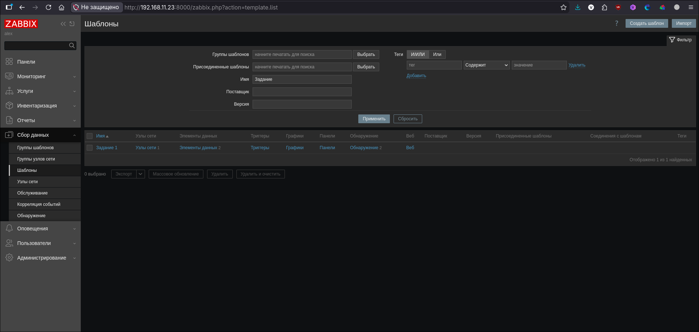
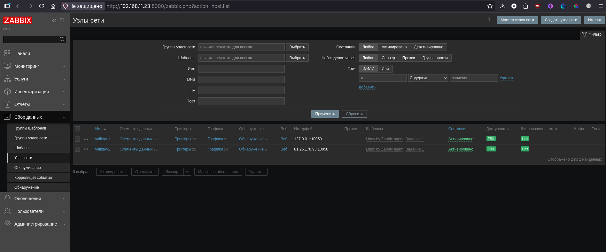
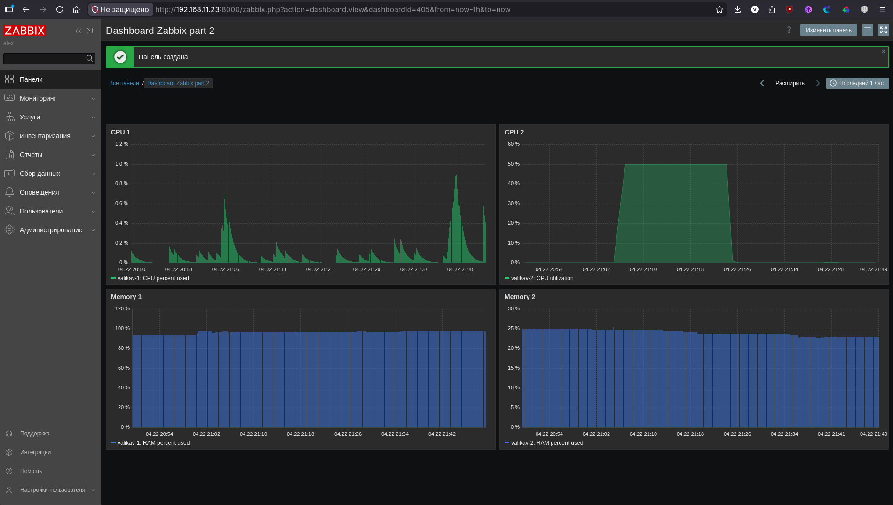
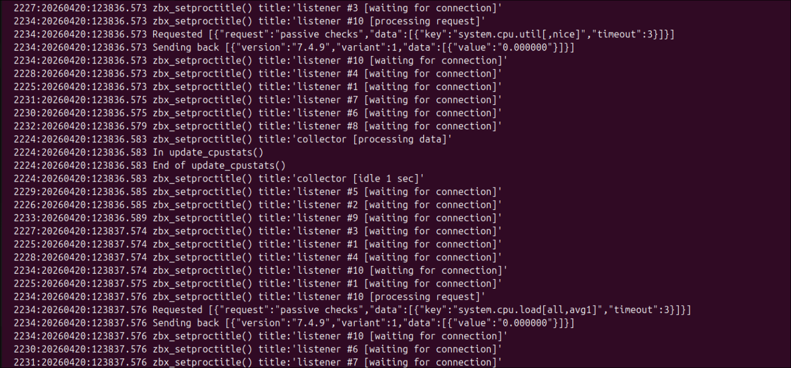
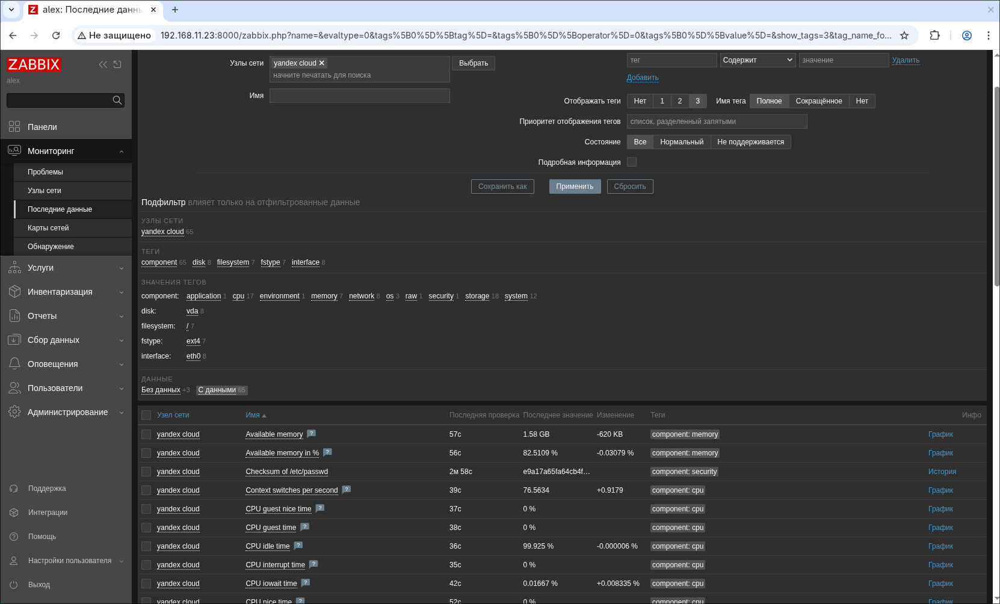
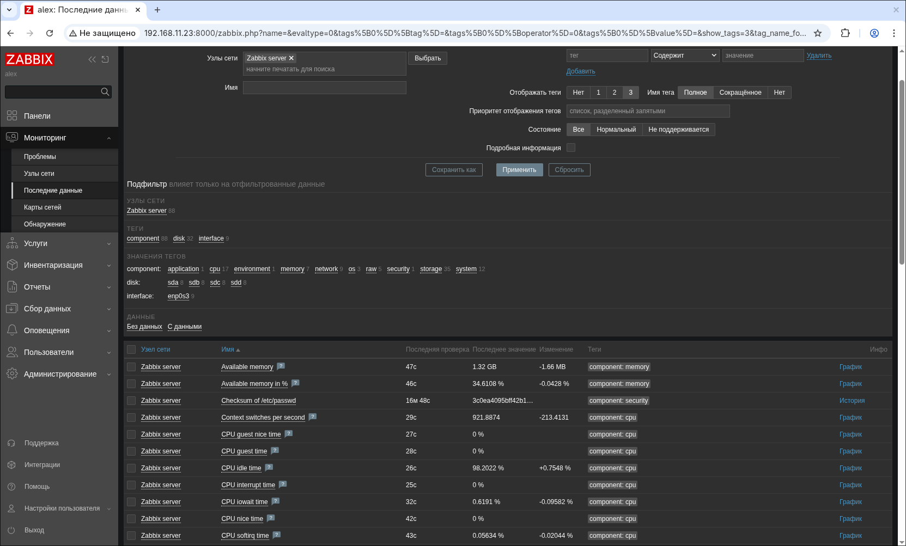

# Домашнее задание к занятию "Zabbix" - Валик Александр

### Задание 1

1. Установлен PostgreSQL
2. wget https://repo.zabbix.com/zabbix/7.4/release/ubuntu/pool/main/z/zabbix-release/zabbix-release_latest_7.4+ubuntu24.04_all.deb
   dpkg -i zabbix-release_latest_7.4+ubuntu24.04_all.deb
   apt update
   apt install zabbix-server-pgsql zabbix-frontend-php php8.3-pgsql zabbix-nginx-conf zabbix-sql-scriptst
3. Установлен Zabbix Server и Zabbix Web Server

    git clone
    git add
    git commit
    git push

### Задание 2

1. Установлен Zabbix Agent на локальную ВМ и на Yandex Cloud
2. Отредектированы файлы /etc/zabbix/zabbix_agentd.conf
3. Добавлены Zabbix Agent в раздел Configuration > Hosts Zabbix Servera

